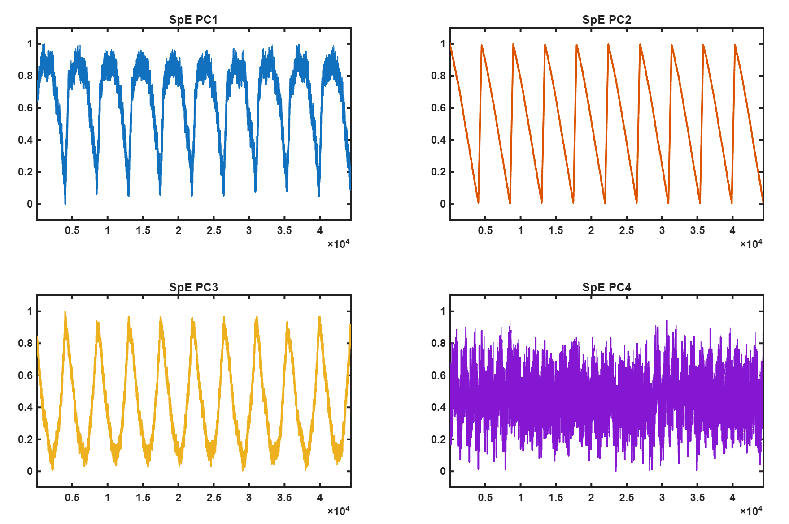
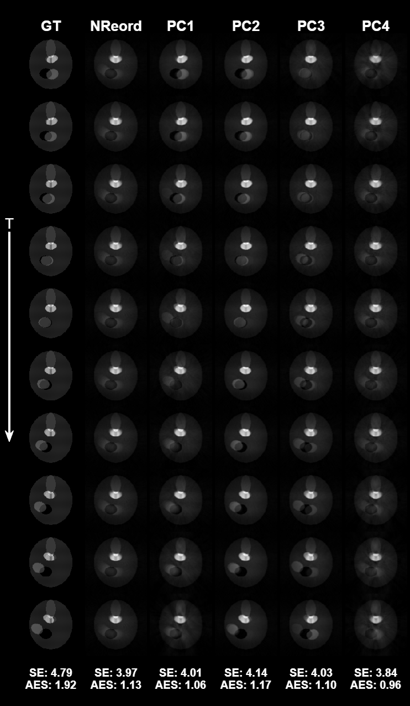

## Related Paper

This repository contains the official research demonstration code accompanying our manuscript currently under review at *Medical Image Analysis (MedIA)*:

### **A self-navigated framework for motion detection and spoke-reordering musculoskeletal dynamic reconstruction in 3D Radial MRI**

---

## Authors

**Enping Lin\*, Fatih Calakli, Musa Tunç Arslan, Giovani Schulte Farina, Simon Keith Warfield**

Boston Children's Hospital  
Harvard Medical School

\* Corresponding author: enping.lin@childrens.harvard.edu

---

## Overview

This repository provides a complete demonstration pipeline for our proposed self-navigated musculoskeletal (MSK) dynamic MRI motion sensing framework based on 3D radial sampling.

The purpose of this package is to clearly demonstrate the complete implementation procedure of the proposed framework described in our MedIA manuscript, including:

- Synthetic non-rigid MSK motion generation
- Golden-angle 3D radial trajectory generation
- Spoke-energy (SpE) motion extraction
- PCA-based motion surrogate generation and different selection
- Dynamic spoke reordering
- Motion-resolved reconstruction
- Quantitative visualization and comparison

To make the entire reconstruction workflow fully reproducible and easy to understand, we also provide our internally developed synthetic MSK motion simulation framework, which can generate different non-rigid motion patterns for evaluating motion-resolved reconstruction methods.

This package is intended to help readers clearly understand how the proposed reconstruction pipeline is implemented step-by-step.

---

## MATLAB Environment

This project was developed and tested using:

```text
MATLAB R2025a
```

## Usage

### Step 1

Open MATLAB and change the current directory to this repository folder:

```matlab
cd('Path_to_SpEMSK')
```

---

### Step 2

Run the main demonstration pipeline:

```matlab
Run_Pipeline
```

The pipeline will automatically:

- Generate synthetic non-rigid MSK motion
- Generate 3D radial trajectories
- Simulate motion-corrupted k-space data
- Extract spoke-energy motion signals
- Generate PCA motion surrogates
- Perform spoke reordering reconstruction
- Display quantitative reconstruction results

---

## Example Results

Running the pipeline will automatically generate the following figures.

---

### 1. PCA-based Motion Surrogate Signals

The figure below shows different PCA motion surrogate components extracted from the spoke-energy (SpE) signals.



---

### 2. Dynamic Reconstruction Comparison

The figure below shows the dynamic reconstruction comparison, including:

- Ground truth reconstruction
- Reconstruction without spoke reordering
- Reconstruction using different PCA components (PC1-PC4)



---

## Repository Structure

```text
SpEMSK/
│
├── Helpers/                    % Helper functions
├── mirt_csp_simplify/          % Reconstruction utilities
├── Results/                    % Example output figures
├── Run_Pipeline.m              % Main demonstration pipeline
└── README.md
```

---

## Notes

- All helper functions required for reconstruction are included in this repository.
- The reconstruction utilities have been integrated into portable standalone function files for easier usage and distribution.
- This repository is intended for research and educational purposes only.

---

## Citation

If you find this code useful, please cite our paper. The citation information will be updated after publication.
